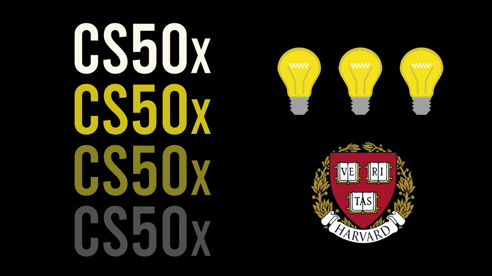

# CS50x 2022 - Introduction to Computer Science

	

Introduction to the intellectual enterprises of computer science and the art of programming. This course teaches students how to think algorithmically and solve problems efficiently.

	<a href="https://cs50.harvard.edu/x/2022/">Course</a>
      <spacer type="horizontal"> ♢ </spacer>
	<a href="https://edstem.org/us/courses/176/discussion/">Ed Community</a>
	      <spacer type="horizontal"> ♢ </spacer>
	<a href="https://cs50.readthedocs.io/style/c/">Style Guide</a>

> A quick word on [Academic Honesty](https://cs50.harvard.edu/x/2020/honesty/). While these solutions will help you to get through the course without too much effort, you should do your best to figure out a working solution yourself before taking a look at any of my solutions. Investing your time and energy into solving the problem sets yourself is in my opinion the only way to eventual mastery.

## 📋 Table of Contents
- [Week 01: C](weeks/week_01/)
  - [Problem Set 01](weeks/week_01/p_set_01/)
- [Week 02: Arrays](weeks/week_02/)
  - [Lab 02](weeks/week_02/lab_02/)
  - [Problem Set 02](weeks/week_02/p_set_02/)
- [Week 03: Algorithms](weeks/week_03/)
  - [Lab 03](weeks/week_03/lab_03/)
  - [Problem Set 03](weeks/week_03/p_set_03/)
- [Week 04: Memory](weeks/week_04/)
  - [Lab 04](weeks/week_04/lab_04/)
  - [Problem Set 04](weeks/week_04/p_set_04/)
- [Week 05: Data Structures](weeks/week_05/)
  - [Lab 05](weeks/week_05/lab_05/)
  - [Problem Set 05](weeks/week_05/p_set_05/)

## ⚙️ Covered on the course
### Topics
- Abstraction
- Algorithms
- Data structures
- Encapsulation
- Resource management
- Security
- Software engineering
- Web programming
### Languages
- C
- Python
- SQL
- HTML
- CSS
- JavaScript
