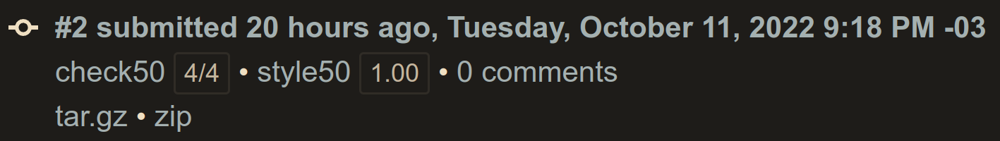
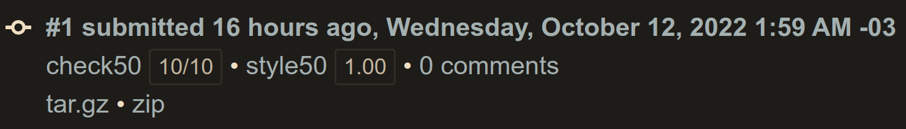
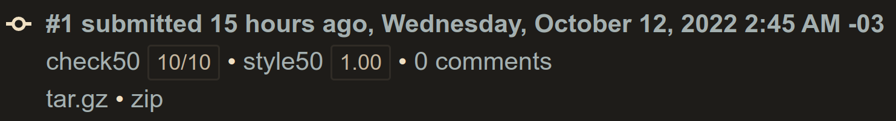
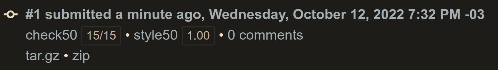
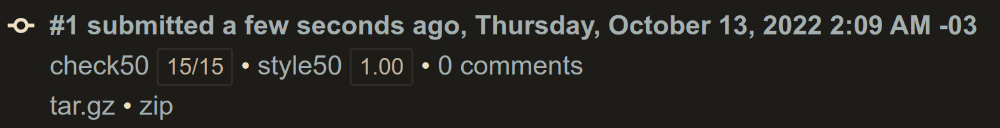

# Problem Set Week 01
- [Problem Set Week 01](#problem-set-week-01)
  - [Lecture](#lecture)
  - [Achievement](#achievement)
  - [Description](#description)
  - [Results](#results)
    - [Hello](#hello)
    - [Mario Less](#mario-less)
    - [Mario More](#mario-more)
    - [Cash](#cash)
    - [Credit](#credit)

## Lecture
[CS50x - Week 1](https://cs50.harvard.edu/x/2022/weeks/1/)

## Achievement

- [x] Hello
- [x] Mario (Less)
- [x] Mario (More)
- [x] Cash
- [x] Credit

## Description

1. Submit [Hello](https://cs50.harvard.edu/x/2022/psets/1/hello/)
2. Submit one of:
   - [this version of Mario](https://cs50.harvard.edu/x/2022/psets/1/mario/less/) if feeling less comfortable
   - [this version of Mario](https://cs50.harvard.edu/x/2022/psets/1/mario/more/) if feeling more comfortable
3. Submit one of:
   - [Cash](https://cs50.harvard.edu/x/2022/psets/1/cash/) if feeling less comfortable
   - [Credit](https://cs50.harvard.edu/x/2022/psets/1/credit/) if feeling more comfortabl

## Results

### Hello

### Mario Less

### Mario More

### Cash

### Credit

