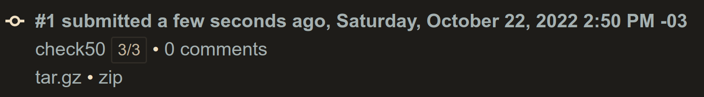
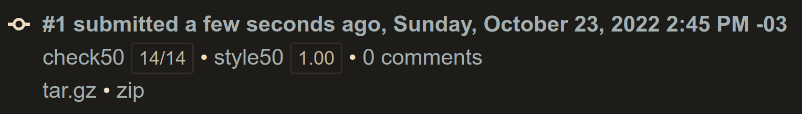
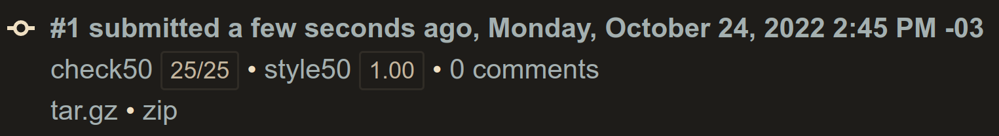
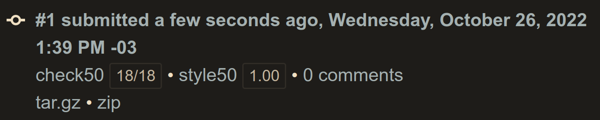

# Week 03 - Algorithms
- [Week 03 - Algorithms](#week-03---algorithms)
  - [Lecture](#lecture)
  - [Achievement](#achievement)
  - [Description](#description)
  - [Results](#results)
    - [Lab 03: Sort](#lab-03-sort)
    - [Plurality](#plurality)
    - [Runoff](#runoff)
    - [Tideman](#tideman)

## Lecture
[CS50x - Week 3](https://cs50.harvard.edu/x/2022/weeks/3/)

## Achievement

- [ ] Lab 3: Sort
- [ ] Plurality
- [ ] Runoff
- [ ] Tideman

## Description

1. [Lab 3: Sort](https://cs50.harvard.edu/x/2022/labs/3/#lab-3-sort)
2. Submit [Plurality](https://cs50.harvard.edu/x/2022/psets/3/plurality/)
3. Submit one of:
	- [Runoff](https://cs50.harvard.edu/x/2022/psets/3/runoff/), if feeling less comfortable
	- [Tideman](https://cs50.harvard.edu/x/2022/psets/3/tideman/), if feeling more comfortable

## Results

### Lab 03: Sort

### Plurality

### Runoff

### Tideman

