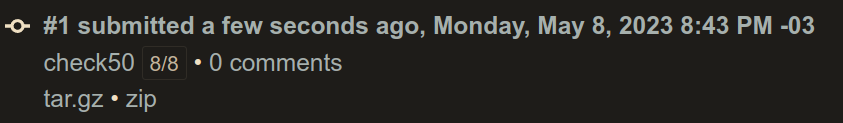
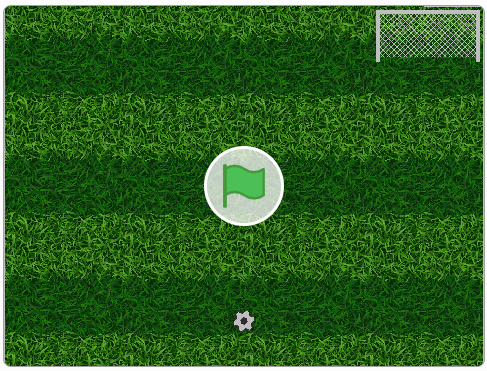

# Week 00 - Scratch
- [Week 00 - Scratch](#week-00---scratch)
  - [Lecture](#lecture)
  - [Achievement](#achievement)
  - [Description](#description)
  - [Results](#results)
    - [Scratch - LINK](#scratch---link)

## Lecture
[CS50x - Week 0](https://cs50.harvard.edu/x/2022/weeks/0/)

## Achievement

- [x] Scratch

## Description

1. Implement your very own Scratch project using Chrome, per [this specification](https://cs50.harvard.edu/x/2022/psets/0/scratch/).

## Results

### Scratch - [LINK](https://scratch.mit.edu/projects/847414253/)

