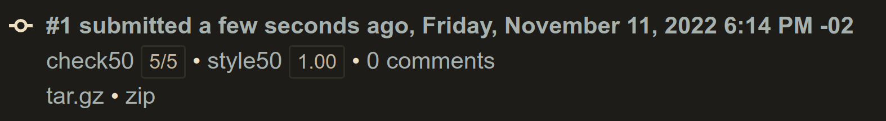
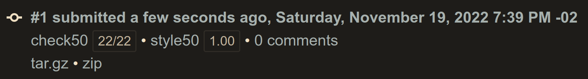
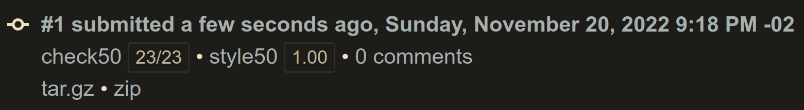
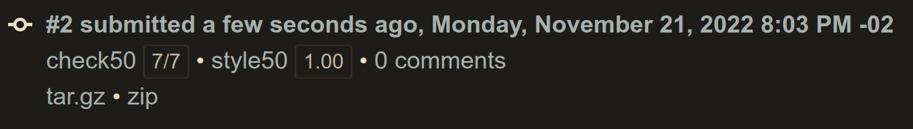

# Week 04 - Memory
- [Week 04 - Memory](#week-04---memory)
	- [Lecture](#lecture)
	- [Achievement](#achievement)
	- [Description](#description)
	- [Results](#results)
		- [Lab 04: Volume](#lab-04-volume)
		- [Filer (Less)](#filer-less)
		- [Filter (More)](#filter-more)
		- [Recover](#recover)

## Lecture
[CS50x - Week 4](https://cs50.harvard.edu/x/2022/weeks/4/)

## Achievement

- [x] Lab 4: Volume
- [x] Filter (Less)
- [ ] Filter (More)
- [ ] Recover

## Description

1. [Lab 4: Volume](https://cs50.harvard.edu/x/2022/labs/4/)
2. Submit one of:
   - [this version of Filter](https://cs50.harvard.edu/x/2022/psets/4/filter/less/) if feeling less comfortable
   - [this version of Filter](https://cs50.harvard.edu/x/2022/psets/4/filter/more/) if feeling more comfortable
3. Submit [Recover](https://cs50.harvard.edu/x/2022/psets/4/recover/)

## Results

### Lab 04: Volume

### Filer (Less)

### Filter (More)

### Recover

