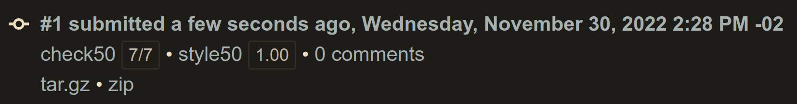
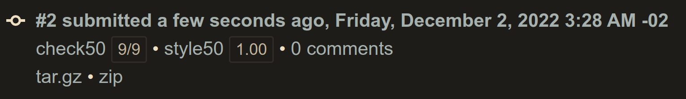

# Week 05 - Data Structures
- [Week 05 - Data Structures](#week-05---data-structures)
	- [Lecture](#lecture)
	- [Achievement](#achievement)
	- [Description](#description)
	- [Results](#results)
		- [Lab 05: Inheritance](#lab-05-inheritance)
		- [Speller](#speller)

## Lecture
[CS50x - Week 5](https://cs50.harvard.edu/x/2022/weeks/5/)

## Achievement

- [ ] Lab 5: Inheritance
- [ ] Speller

## Description

1. [Lab 5: Inheritance](https://cs50.harvard.edu/x/2022/labs/5/)
2. Submit [Speller](https://cs50.harvard.edu/x/2022/psets/5/speller/)

## Results

### Lab 05: Inheritance

### Speller

