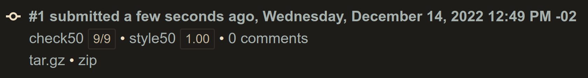
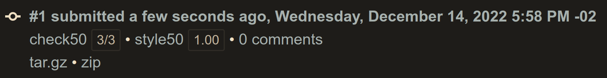

# Week 06 - Python
- [Week 06 - Python](#week-06---python)
	- [Lecture](#lecture)
	- [Achievement](#achievement)
	- [Description](#description)
	- [Results](#results)
		- [Lab 06: World Cup](#lab-06-world-cup)
		- [Sentimental - Hello](#sentimental---hello)
		- [Sentimental - Mario (Less)](#sentimental---mario-less)
		- [Sentimental - Mario (More)](#sentimental---mario-more)
		- [Sentimental - Cash](#sentimental---cash)
		- [Sentimental - Credit](#sentimental---credit)
		- [Sentimental - Readability](#sentimental---readability)

## Lecture
[CS50x - Week 6](https://cs50.harvard.edu/x/2022/weeks/6/)
## Achievement

- [x] Lab 6: World Cup
- [ ] Sentimental - Hello
- [ ] Sentimental - Mario (Less)
- [ ] Sentimental - Mario (More)
- [ ] Sentimental - Cash
- [ ] Sentimental - Credit
- [ ] Sentimental - Readability
- [ ] DNA

## Description

1. [Lab 6: World Cup](https://cs50.harvard.edu/x/2022/labs/6/)
2. Submit [Hello](https://cs50.harvard.edu/x/2022/psets/6/hello/) in Python
3. Submit one of:
   - [this version of Mario](https://cs50.harvard.edu/x/2022/psets/6/mario/less/) in Python, if feeling less comfortable
   - [this version of Mario](https://cs50.harvard.edu/x/2022/psets/6/mario/more/) in Python, if feeling more comfortable
4. Submit one of:
   - [Cash](https://cs50.harvard.edu/x/2022/psets/6/cash/) in Python, if feeling less comfortable
   - [Credit](https://cs50.harvard.edu/x/2022/psets/6/credit/) in Python, if feeling more sentimental_mariobless_restult. Submit [Readability](https://cs50.harvard.edu/x/2022/psets/6/readability/) in Python
5. Submit [DNA](https://cs50.harvard.edu/x/2022/psets/6/dna/) in Pythonhttps://cs50.harvard.edu/x/2022/psets/5/speller/)

## Results

### Lab 06: World Cup

### Sentimental - Hello

### Sentimental - Mario (Less)

### Sentimental - Mario (More)

### Sentimental - Cash

### Sentimental - Credit

### Sentimental - Readability

