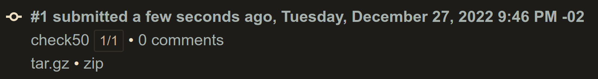
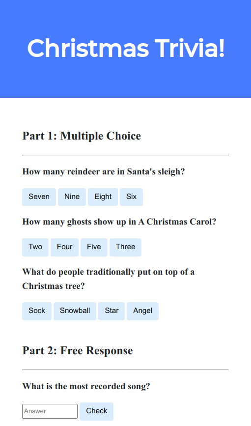
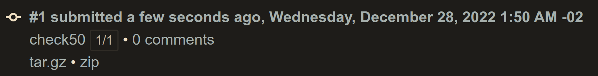
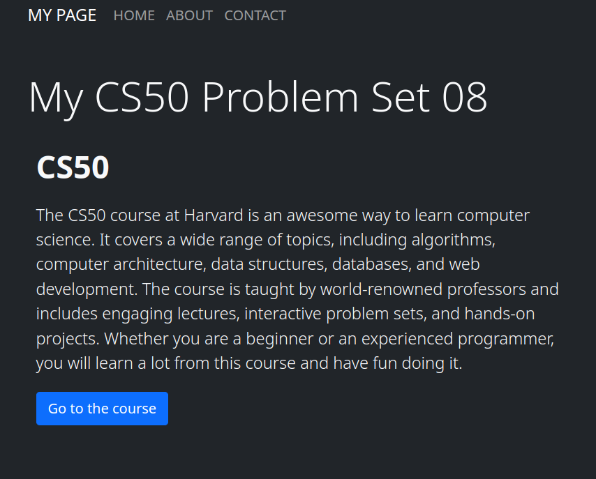

# Week 08 - HTML, CSS, JavaScript
- [Week 08 - HTML, CSS, JavaScript](#week-08---html-css-javascript)
  - [Lecture](#lecture)
  - [Achievement](#achievement)
  - [Description](#description)
  - [Results](#results)
    - [Lab 08: Trivia - DEMO](#lab-08-trivia---demo)
    - [Homepage - DEMO](#homepage---demo)

## Lecture
[CS50x - Week 8](https://cs50.harvard.edu/x/2022/weeks/8/)
## Achievement

- [x] Lab 8: Trivia
- [x] Homepage

## Description

0. [Lab 8: Trivia](https://cs50.harvard.edu/x/2022/labs/8/)
1. Submit [Homepage](https://cs50.harvard.edu/x/2022/psets/8/homepage/)

## Results

### Lab 08: Trivia - [DEMO](https://christmastrivia.netlify.app/)

### Homepage - [DEMO](https://pset08.netlify.app/)

