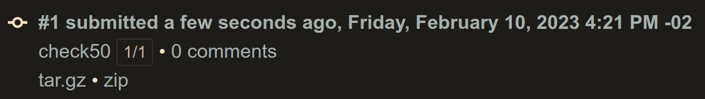
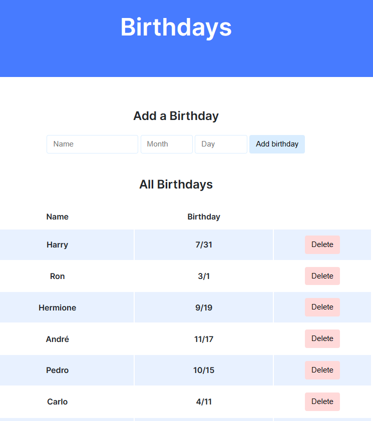
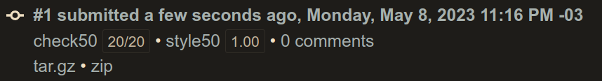
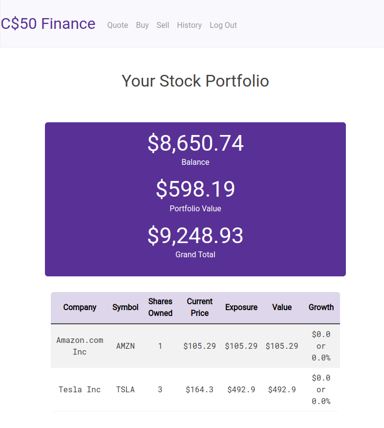

# Week 09 - Flask
- [Week 09 - Flask](#week-09---flask)
  - [Lecture](#lecture)
  - [Achievement](#achievement)
  - [Description](#description)
  - [Results](#results)
    - [Lab 09: Birthdays](#lab-09-birthdays)
    - [Homepage Finance](#homepage-finance)

## Lecture
[CS50x - Week 9](https://cs50.harvard.edu/x/2022/weeks/9/)
## Achievement

- [x] Lab 8: Birthdays
- [ ] Finance

## Description

1. [Lab 9: Birthdays](https://cs50.harvard.edu/x/2022/labs/9/)
2. Submit [Finance](https://cs50.harvard.edu/x/2022/psets/9/finance/)

## Results

[Comentario]: # (TODO: Adicionar prints)

### Lab 09: Birthdays

### Homepage Finance

